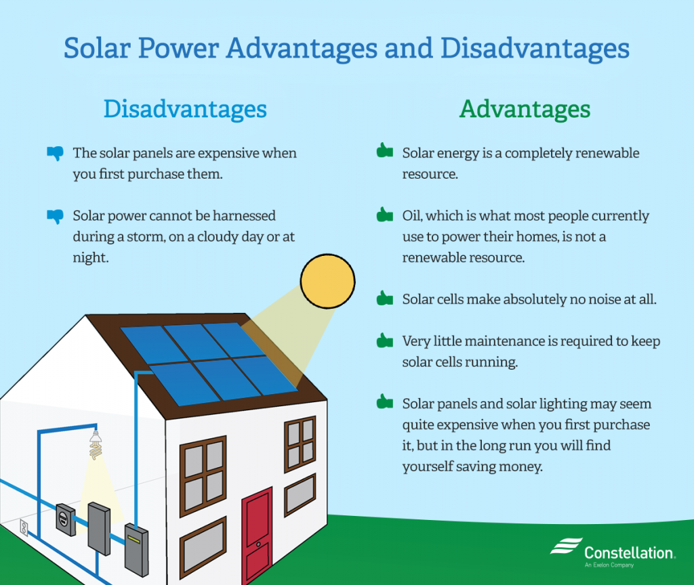
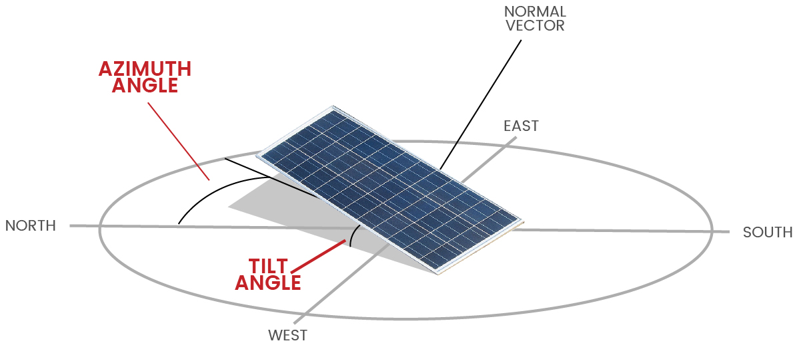
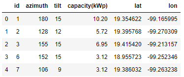

# Introduction
Traditional electricity relies heavily on fossil fuels such as coal and natural gas. Not only are these resources bad for the environment, but they are also limited. Photovoltaic (PV) Systems have become popular alternatives to conventional domestic energy consumption in Mexico City in recent years. However, the process of adopting such systems often implies elevated capital costs and dealing with technical terms which are not familiar to most energy consumers. As a result, their penetration in the market has been rather slow. According to Inegi statistics:  99% of the inhabited homes in Mexico have electricity; of these, just 0.25% use solar energy as an alternative source, either exclusively, or in a bidirectional/hybrid system (solar and public electricity combined). House photovoltaic systems seemingly have a massive opportunity in the market, however, the use of this technology is very expensive. The possibility of decreasing monthly electricity fees will only be feasible and justifiable if the consumption is high enough to recover the initial investment within a reasonable period of time. There are existing tools for determining the savings of using domestic photovoltaic systems; however, they are not available for Mexico. In this project, we will use Machine Learning to model the specific production possibilities for each region in the Mexico City Metropolitan Area to allow the users to evaluate if this investment is appropriate for them.
 

# Problem outline
* While some tools have been developed to help consumers decide whether or not distributed photovoltaic systems are suitable options for them, such tools are not always available in the Mexican market.
* Installers often have to prepare technical proposals and run costly simulations to offer clients a project which will not always be bought, resulting in wasted money and time for the companies.
 
Predictive models relying on machine learning could help consumers decide whether or not they should adopt such systems, while saving installers’ time and effort devoted to generate technical proposals for clients who ultimately choose not to buy them. Users could use such models to get a preliminary idea on whether a PV system is adequate for them to later get a formal quotation with all the technical requirements from a professional installer.

# Objectives
* Use historical data from different photovoltaic systems in the Mexico City Metropolitan Area to show the impact that key metrics have on the production of electricity.
* Create a model using Machine Learning that can show users the feasibility of buying a domestic photovoltaic system based on their annual electricity consumption.
* Calculate the time in which the user will recover the initial investment that installing a domestic photovoltaic system requires.
* Provide a tool for companies that sell and install domestic photovoltaic systems that is fast, easy to use and free.

# Available Data
* Daily energy production data from 16 domestic-scale photovoltaic systems in the Mexico City Metropolitan Area as reported by the inverter provider of each of the sites.
* Daily weather data from the Historical or past weather API from World Weather Online. The data was collected using the coordinates’ sites for each of the production dates. (https://www.worldweatheronline.com/developer/api/docs/historical-weather-api.aspx#astronomy_element). The following columns were extracted from the API response:
    * uvIndex: It is an indicator of ultraviolet radiation intensity from the sun on the Earth’s surface. Its values range from 0 to 1.
    * sunHour: Total sun hours in a given day 
    * Cloudcover: Cloud cover amount in percentage (%)
    * maxTempC: Maximum temperature of the day in degree Celsius minTempC: Minimum temperature of the day in degree Celsius
    * Precipitation: Precipitation in milimeters
* Installation data from the selected sites:
    * Installed capacity (kWp): This variable depends on the total installed panels and the power rating of each one of them. It is the maximum power output that a given system could provide at any given time under test conditions. Typically, PV systems will operate at power levels below the installed capacity.
    * Coordinates: These indicate the site's location. The angle of incidence of the solar rays depend on the site's latitude. Weather parameters are also dependent on the site's location.
    * Azimuth: A measure of the panels' orientation in a PV system. It is measured as an angle starting from the North coordinate in an Eastern-wise direction. Ideal azimuth parameters for PV systems in the Northern Hemisphere should be close to 180° (true south).
    * Tilt (slope): These are parameters that affect the incidence angle of the sun rays on the solar panel, thus affecting the power production of the PV system.
     

# Model considerations
The provided data was pre-treated and filtered under the following considerations:
## Datasets
### Sites
Dataframe that contains all the data related to each one of the 16 solar plants. 
 

### Daily data
This table has all the available historical data from all the sites. The data goes from december 2016 to july 2020. The data is available by day for each one of the sites; it’s important to emphasize that not all the available data from the sites is available for the same period of time.
 

Once the data was available in the Heroku database, we proceeded to create a dataframe with the necessary data to create a Machine Learning model. The objective of this model is to predict the specific production based on continuous data related to the specific location of each site.
 

# Model
We used ‘Random Forest Regression’ from Sklearn to train a model. As part of the development of the solution, we used Grid Search to find the best possible score, testing five different quantities of estimators. Finally, we obtained a model with score of 0.63. As part of our proposal, we created five more datasets in order to test the machine learning model. The dataset was created from five locations in Mexico City; the table contains all the necessary columns for the machine learning model to work and predict the specific production of the location. It should be noted that the machine learning model outputs daily production, the final output is grouped into a whole year to account for yearly production variations.
 
 
The final predictions were made using an azimuth angle of 180° and a tilt angle of 11°. The predicted production could be different depending on the selection of these parameters.
 

As a result of the whole machine learning process, we obtained a dictionary that contains the predicted specific production for each zone:

| Location | Latitude  | Longitude  | Specific yearly production (kWh/kWp) |
|----------|-----------|------------|--------------------------------------|
| North    | 19.560209 | -99.127307 | 1,624                                |
| South    | 19.278835 | -99.142413 | 1,587                                |
| East     | 19.404850 | -98.992381 | 1,594                                |
| West     | 19.399021 | -99.245410 | 1,602                                |
| Downtown | 19.423630 | -99.131770 | 1,587                                |

# Final calculation
The final panel estimation uses the user's inputs to estimate the number of panels needed to supply their energy consuption and their repayment time. The user inputs are the following:
* Yearly energy consumption (from the last year)
* Yearly paid amount (from the last year)
* Location (this is limited to the 5 locations specified in the <em>Model</em> section)

The final calculation takes these three inputs and outputs the optimal number of panels, the downpayment (in MXN) and the time for breakeven (in years). <strong>This model is only meant to give the user an initial idea on whether the system is feasible or not and should not be used as a definitive installation proposal, which should be validated with a professional installer.</strong> These are the calculations performed:
 

## Considerations
* The module price is set to be 2 USD/Wp (installed watts)
* The exchange rate is set to 22 MXN/USD
* The production scenario is set to the one obtained in the machine learning model and depends on the selected location
* A 180° azimuth angle and 11° tilt are considered to do the final production calculation. 
* This model is only valid for simulations within the Mexico City Metropolitan Area.

# Conclusions and next steps
This tool provides a useful guide for users trying to determine whether a PV system is feasible for them or not. However, this just gives an initial idea and the technical proposal offered by a professional installer may vary. Please make sure to validate these results with a real proposal before making any decisions.
* Train the model with production data from other locations to generalize the results
* Let the user input their address or coordinates and call the data from an API

